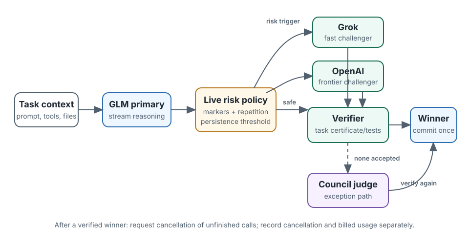

> **Status: ongoing, preliminary, and not peer reviewed.** This page is a
> research programme, not a finished paper. It records what is exploratory,
> what has been specified prospectively, and what evidence would change the
> current view.

## The question

Difficulty-response curves estimate the probability that a model succeeds as
a task gets harder. The next question is whether information produced during a
single call can improve that probability:

> Can reasoning traces, billing metadata, latency, or throughput improve a
> calibrated probability of correctness beyond the difficulty curve itself?

MiniMax-M2.5 is the first deep dive. Its existing visible-trace frontier lane
contains correct answers, silently wrong answers, and conspicuous truncations.
That makes it possible to distinguish two operational problems that are often
blurred together: detecting an answer that is wrong despite completing
normally, and detecting a call that failed loudly.

The next control question follows directly: if an unfolding trace looks risky,
should the harness wait for a confidence score, or use that signal immediately
to launch a second model? We call the latter **trace-triggered speculative
execution**. It is related to a model council, but it races verified candidates
instead of waiting to combine every answer.

## Current evidence

| Status | Claim | Current reading |
|---|---|---|
| **Supported** | Difficulty curves provide a useful baseline probability. | The existing instrument estimates a frontier and sharpness from fresh, mechanically graded tasks. |
| **Not supported** | The frozen trace dictionary improves calibrated confidence retrospectively. | Trace-only AUROC was 0.671 and Brier skill was 7.4%; its clustered interval crossed zero. The earlier AUC 0.93 trace judge did not transfer into a strong calibrated score under the frozen v1 comparison. |
| **Exploratory** | Billing and serving metadata add information at the frontier. | Metadata-only AUROC was 0.852 and Brier skill was 36.9% over the cross-fitted curve prior. This passed the retrospective spend gate but still requires prospective validation. |
| **Prospective** | A frozen combined score improves probability calibration. | The MiniMax v1 protocol specifies the comparison, endpoints, stopping rule, and spend gate before any new calls. |
| **Prospective** | Trace risk can control conditional model fan-out. | The v0 speculative-council protocol freezes an auditable live-risk policy and compares it with GLM-only, always-on council, and matched-rate fixed-delay hedging. No live spend is authorised yet. |
| **Censored** | End-to-end billed tokens per second measures generation speed. | It does not: the denominator includes queueing, retries, transport, and provider overhead. Streaming telemetry is required for an observed output rate. |

## Study sequence

1. **Retrospective calibration.** Treat all existing MiniMax calls as
   exploratory for this new question. Compare a curve-only prior with
   metadata-only, trace-only, and combined confidence models using
   instance-grouped out-of-sample predictions.
2. **Spend gate.** Spend nothing unless the retrospective cohort contains at
   least 20 silently wrong calls, the best frozen model reaches AUROC 0.75,
   and its Brier skill over the curve prior is at least 10%.
3. **Prospective validation.** If the gate passes, evaluate the frozen score
   once on fresh instances. Stop after at least 60 correct and 60 silently
   wrong completed calls, or at 600 calls / USD 40.
4. **Streaming feasibility.** Reserve at most USD 10. Proceed only if the
   prospective confidence result passes. Measure time to first token,
   reasoning and answer channel timing, inter-chunk gaps, and observed output
   rate.
5. **Control study.** Independently replay timestamped traces through a frozen
   live-risk policy. Only after a separate gate and budget registration should
   the harness compare conditional fan-out with an ordinary always-on model
   council and a matched-rate time-only hedge.

Protocols: [MiniMax confidence v1](minimax-confidence-protocol.html) ·
[trace-triggered speculative councils v0](speculative-council-protocol.html).

## Retrospective checkpoint: gate passed

The v1 retrospective cohort contains 145 calls on 30 generated instances: 61
correct completions, 24 silently wrong completions, and 60 loud failures. No
new calls were made for this analysis.

The selected metadata-only score reached AUROC 0.852 and Brier skill 0.369
relative to the cross-fitted curve prior. The 95% instance-cluster bootstrap
interval for Brier skill was 0.115 to 0.576. At 50% coverage, retaining the
calls with the highest out-of-fold confidence kept 40 of 43 answers correct.

The simplest reading is also the most interesting. Silently wrong completions
used 54.7k billed tokens on average versus 36.1k for correct completions and
took 756 seconds versus 524 seconds. Effective billed tokens per second barely
moved: 77.4 for wrong and 77.7 for correct. MiniMax did not become slower when
it went wrong; it kept thinking for longer. The frozen prospective model is
therefore metadata-only. This remains an exploratory finding until the fresh
one-look batch reports.

Reproducibility: [result JSON](data/confidence-minimax.json) ·
[compact study table](data/minimax-confidence-v1.jsonl.gz) ·
[raw trace artifact](data/minimax-confidence-v1-traces.jsonl.gz).

## Why this differs from a confidence heuristic

The primary endpoint is the Brier score: the mean squared error of the stated
probability. A useful score must improve probability calibration, not merely
rank failures. AUROC, log loss, calibration plots, and risk-coverage curves are
secondary views. All folds are grouped by generated instance so repeated
samples from the same puzzle cannot leak across training and evaluation.

The model, route, provider, token cap, prompt version, and frontier window are
fixed. Correct completed answers and silently wrong completed answers form the
confidence task. Truncations, parse failures, refusals, timeouts, and API errors
are a separate loud-failure outcome.

## From confidence to control

A conventional model council pays for several completed answers and then
votes, ranks, critiques, or synthesises them. That can improve quality, but it
usually pays the full fan-out latency and token bill. The proposed speculative
controller starts with one trace-visible primary and makes two separate
decisions:

1. **Launch:** persistent trace risk pauses external side effects, checkpoints
   the reproducible task context, and starts Grok and OpenAI challengers in
   isolated lanes.
2. **Accept:** the first candidate that passes a task-specific verifier wins;
   unfinished calls receive cancellation requests. If no candidate verifies,
   the system may enter a council-synthesis exception path.

| Ordinary model council | Trace-triggered speculative controller |
|---|---|
| Launches several models by default | Launches challengers only after persistent risk or primary rejection |
| Waits to aggregate completed answers | Can stop at the first independently verified answer |
| Optimises ensemble answer quality | Gates quality, then optimises latency and billed work |
| Uses completed outputs | Uses the primary's unfolding trajectory |
| Usually pays the full fan-out | Requests cancellation and measures whether billing actually stops |

The harness implementation is deliberately strict. `drc hedge` requires an
external verifier, an acceptance expression, or an explicit unsafe
`--accept-first` flag. It computes worst-case authorised model cost before
launch, emits the live marker counts and trigger snapshot, pauses through a
caller-supplied side-effect hook, copies structured task context without
sharing hidden chain of thought, and records cancellation separately from
provider-reported usage.

This design borrows answer aggregation from
[LLM-Blender](https://aclanthology.org/2023.acl-long.792/) and
[Mixture-of-Agents](https://arxiv.org/abs/2406.04692), but its systems shape is
closer to the hedged requests in
[The Tail at Scale](https://research.google/pubs/the-tail-at-scale/). The new
hypothesis is that trace deterioration can replace a fixed delay as the hedge
trigger. That remains **Prospective** until an offline replay beats a
matched-rate time-only trigger and a separately budgeted live comparison
passes.

## Related work

This programme sits between dynamic model evaluation, psychometric model
measurement, and inference-time routing. Generated evaluations such as
[GSM-Symbolic](https://arxiv.org/abs/2410.05229) and
[Dynamic Evaluation by Meta Probing Agents](https://proceedings.mlr.press/v235/zhu24m.html)
reduce dependence on static test banks. [IRT-Router](https://aclanthology.org/2025.acl-long.761/)
and [RouteLLM](https://arxiv.org/abs/2406.18665) connect estimated difficulty
or preference to model selection. [Self-Consistency](https://arxiv.org/abs/2203.11171)
uses agreement across sampled reasoning paths. The present study asks a
narrower deployment question: after controlling for a model's measured
difficulty frontier, does its own trace or serving telemetry provide calibrated
evidence about this particular answer?

## Open record

The dated [field journal](journal.html) is preserved as process evidence. The
public protocol is committed before the prospective batch. Results are
reported whether the gate passes or fails, and a failed gate stops spend rather
than becoming a new round of feature search.

Code is licensed under MIT. Research text and released study data are licensed
under CC BY 4.0, subject to the terms of the providers that produced model
responses.
